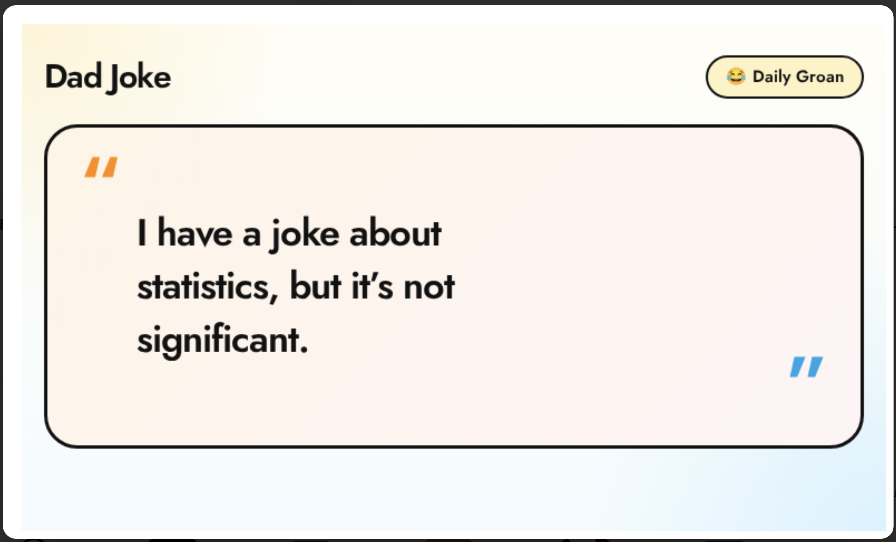
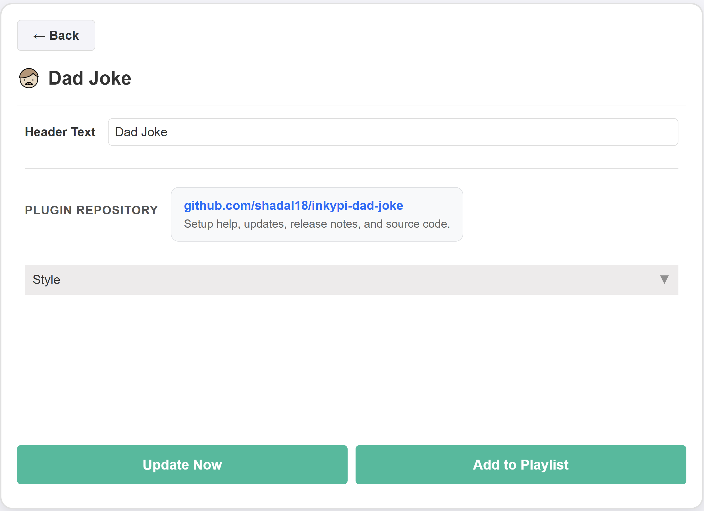

# InkyPi Dad Joke

An InkyPi plugin that shows a dad joke with configurable text settings.

## Install

Use the InkyPi plugin installer with the plugin ID and this repository URL, following the install pattern shown by the official InkyPi plugin template.

```bash
inkypi plugin install dad_joke https://github.com/shadal18/inkypi-dad-joke
```

## Update

To update the plugin on your InkyPi device:

1. SSH into your InkyPi host.
2. Change into the plugin directory:
   ```bash
   cd ~/InkyPi/src/plugins/dad_joke
   ```
3. Run this update command:
   ```bash
   git pull origin main && \
   if [ -d dad_joke ]; then \
     rsync -a dad_joke/ ./ && \
     rm -rf dad_joke; \
   fi && \
   sudo systemctl restart inkypi.service
   ```

If you don’t see your changes after updating:

- Confirm you are in the correct plugin folder.
- Clear your browser cache or hard refresh the InkyPi web UI.
- Check the InkyPi logs for any plugin errors.

## Requirements

- An API Ninjas account with a configured API key for dad joke requests.
- A valid InkyPi environment key named `API_NINJAS_KEY`.
- Network access from the InkyPi device to the API Ninjas API endpoint.

## Features

This plugin is an extension for the InkyPi e-paper display frame and includes the following features.

- Shows a random dad joke from the API Ninjas Dad Jokes API.
- Family-friendly and workplace-safe joke source.
- Large, centered joke layout optimized for quick glance reading on e-paper.
- Styled quote-card presentation instead of plain text output.
- Optional custom header text.
- Optional custom footer text.

## Settings

The plugin settings page lets you customize:

- Header text.
- Footer text.

## API Key Setup

This plugin requires one API key from API Ninjas.

### Create the API key

1. Create or log into your API Ninjas account at [https://api-ninjas.com](https://api-ninjas.com).
2. Open your API Ninjas dashboard.
3. Generate or copy your API key for use with the [Dad Jokes API](https://api-ninjas.com/api/dadjokes).

### Add the key in InkyPi

1. Open the InkyPi front page.
2. Click the **key icon**.
3. Add a new key named `API_NINJAS_KEY`.
4. Paste in your API Ninjas API key.
5. Save it.
6. Restart InkyPi if needed.

## API Endpoint Used

This plugin currently reads data from the following API Ninjas endpoint:

- `/v1/dadjokes`

This endpoint provides random dad jokes, and the API description notes that the jokes are family-friendly and workplace-safe.

## Repository

GitHub repository:

[https://github.com/shadal18/inkypi-dad-joke](https://github.com/shadal18/inkypi-dad-joke)

## Screenshots

- Main plugin display showing a dad joke.
- Plugin settings screen.

<p align="center">
  
  
</p>
